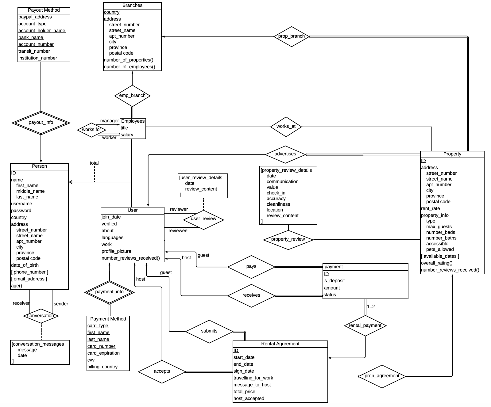

# CSI2132 PROJECT - AirBnB 
Authors: Kyle Pinkerton (8122569) David Hew-wing ()
Our attempt at cloning AirBnB for our CSI2132 Winter 2020 Project.

# How to get the project running 
1. pip install -r requirements.txt (PYTHON 3)
2. go to `db.py` file in the `db` directory, at the top you will see you will see the variables: `dbname = "kpink074", user = "kpink074", password = os.environ.get("UOTTAWA_PW"), host = "web0.site.uottawa.ca", port = "15432", schema = "project"`
3. Enter your relevant information to the above to connect to your specific db instance
4. Use create table statements in `DDL.sql` file in the `db` directory to create all the required tables in pgadmin4 (statements lower in the file depend on statements higher in the file)
5. Run the app `python app.py`(note: you cannot generate branches in the app right now, so if you want to create user profiles/properties/etc in the app you must insert a row into the branches table first)

## Front-end constraints (cuz of yolo)
1. Only some countries allowed (Canada, US, UK, Australia, France)
2. No spaces in propertynames or usernames
3. You can only have 1 payment method, 1 payout method, 1 phone, 1 email 
4. probably other things...

## ER Diagram

## fix?
- payment/payout tables should have all keys as primary keys... or not? (right now there is if statement on payment/payout pages not letting u add more than 1)